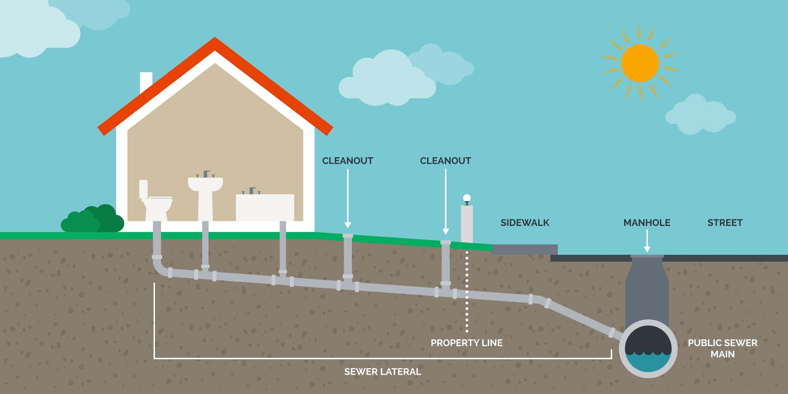
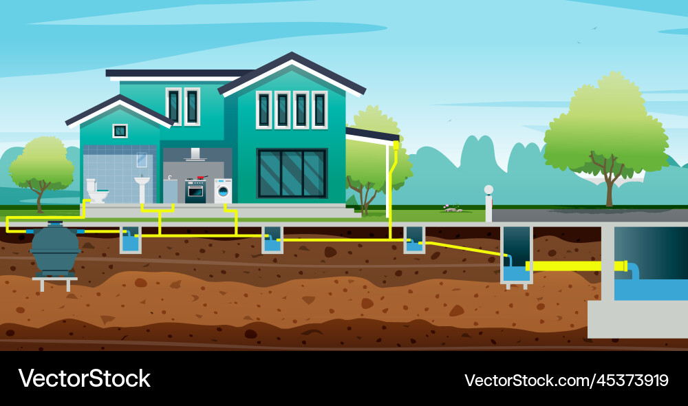
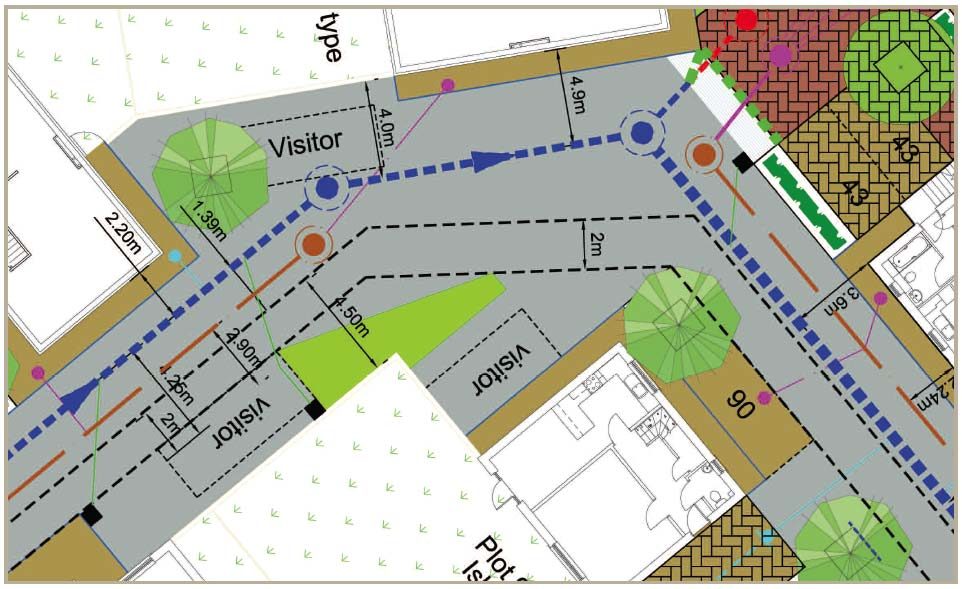

---------------------------

At **3E Design Services**, we provide comprehensive support in site grading, drainage, and servicing to ensure projects are designed for optimal functionality and sustainability. Our customized solutions address the unique challenges of each project while meeting city requirements for site grading, site drainage, and site servicing. 

## Design Support Service:

At **3E Design Services**, we provide support in the following areas, but not limited to:

- Site Grading, Site Drainage and Site Servicing Plan
- Site Grading & Drainage Plan  
       - Ensures cut-and-fill volumes are minimized to achieve cost-effective and balanced grading.
       - Maintains positive overland flow across the site for effective drainage.
       - Prevents adverse impacts on neighboring properties by effectively managing grading and drainage.
       - Limits surface ponding to a maximum depth of 0.30 m, ensuring alignment with the site’s drainage and servicing plan.
- Drainage Plan 
       - Pre Development : Analysis of existing conditions to understand baseline drainage requirements.
       - Post Development : Implementation of strategies to manage increased runoff and maintain water balance.
- Site Servicing Plan
       - Design of water supply systems to meet project demands.
       - Design of sanitary sewer systems to ensure efficient wastewater management.
       - Design of storm sewer systems to effectively handle stormwater runoff.

## Partner With Us

Our expertise in grading, drainage, and servicing ensures that every project is built on a solid foundation of functionality and environmental responsibility. Partner with **3E Design Services** to create efficient, sustainable, and compliant designs that exceed expectations.

-------------------------------------

- Fig.........................................1

 

-----------------------------

- Fig.........................................2

-----------------------------

- Fig.........................................2

-------------------------------------------------------------------
**Contact Us:** \
We would be delighted to hear from you and explore how we can assist you. \
Email: ardbd70@gmail.com
   
--------------------------------------